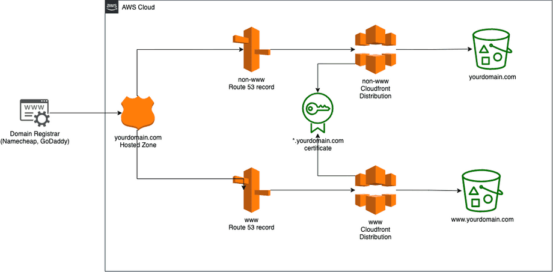

# Website

This terraform module setups a static website using S3, ACM, Route53 and Cloudfront.



## Usage
```terraform
module "website" {
  source = "github.com/devpies/saas-infra//modules/website?ref=main"
  stage = "dev"
  region = "eu-central-1"
  domain_name = "example.com"
  common_tags = { stage = dev } # optional
}
```

[source: alexhyett](https://www.alexhyett.com/terraform-s3-static-website-hosting)
